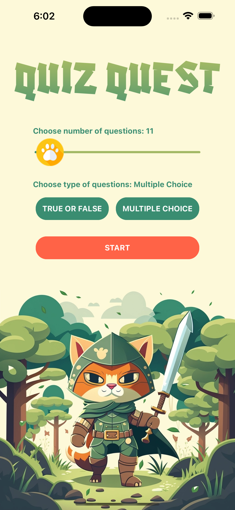
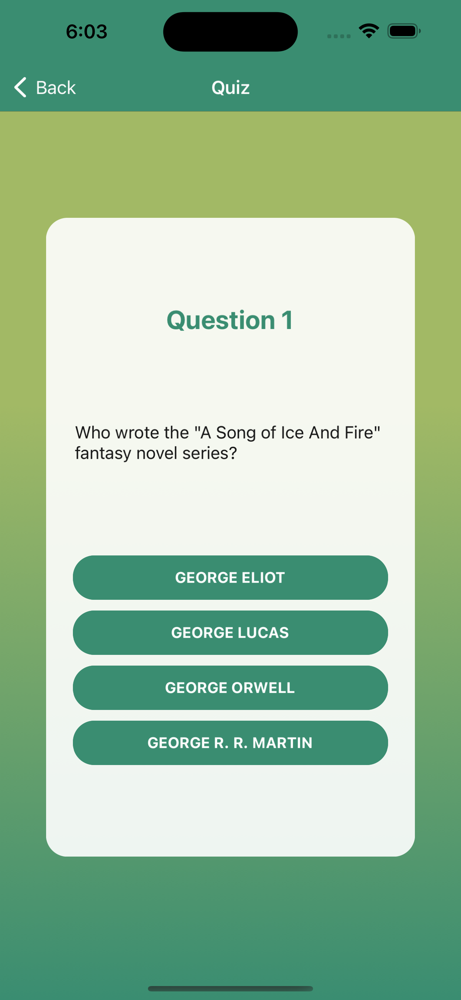
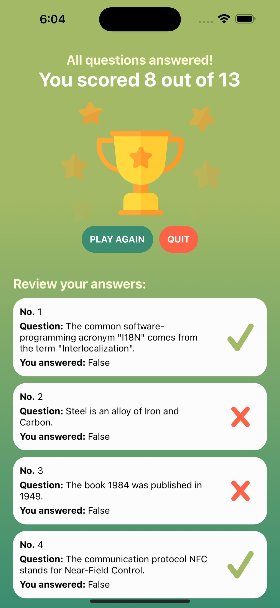

# ⚔️ QUIZ QUEST 🐱

QUIZ QUEST is an app I built using React Native (expo) as an upskilling project.
I was provided with a basic skeleton app and some pre-written functions containing API calls. 

## Index
- [Tech](#tech)
- [Process](#process)
- [Screenshots](#screenshots)
- [Read The Full Brief](#brief)

## Tech
- React Native with Expo
- Animation: [Lottie](https://airbnb.io/lottie/#/) [Lottie files](https://lottiefiles.com/)
- Number picker slider: [@react-native-community/slider](https://www.npmjs.com/package/@react-native-community/slider)
- Gradients: [Expo Linear Gradient](https://docs.expo.dev/versions/latest/sdk/linear-gradient/)
- [@react-native-masked-view/masked-view
](https://www.npmjs.com/package/@react-native-masked-view/masked-view) (to assist with gradient text)
- [Expo Google Fonts](https://github.com/expo/google-fonts)
- Home screen illustration created with [Midjourney](https://www.midjourney.com/home/?callbackUrl=%2Fapp%2F)

## Process
I created a quizContext to hold all the information that my components would need to access during the user journey. This is the first time I've tried [useReducer](https://beta.reactjs.org/reference/react/useReducer) with [context](https://reactjs.org/docs/context.html), which I felt compelled to try in order to keep the context from getting out of hand. [This Youtube tutorial](https://www.youtube.com/watch?v=awGFsGc9oCM&ab_channel=DesignCode) was a great help in understanding that!

As well as completing the tasks provided in the brief, I spent some time designing an attractive frontend for the app. I'd been playing around with Midjourney for a little while, so I used this to generate the initial illustration, then I created a colour theme around it. I also tried out implementing animations for the time in a React Native app, which I achieved using [Lottie](https://airbnb.io/lottie/#/) and now I really want to try more!

## Screenshots

  <tr>
    <td></td>
    <td></td>
    <td></td>
  </tr>

---

## Brief

_"I have provided a basic skeleton app with navigation and three screens as well as an API, with examples of it's usage (in Quiz.jsx).
Three REST API calls are pre-written as functions that are given to you in the
src/api/quiz.js file:_"

1 - getTrueFalseQuestions: 10 questions in true/false format

2 - getRegularQuestions: 10 questions in 4 answer format

3 - getSpecificNumberOfRegularQuestions(number): given n => n questions in 4 answer format NOTE: MUST BE LESS THAN 50 questions

### Create an app where:
- Using the function getTrueFalseQuestions, display 10 questions in a paginated view or list/scrollview.
- User can select true or false on the question
- Result is stored (in a context provider, which you will have to create and wrap around the app)
- At the end user is showed which answers were correct, which answers the user guessed and their score
- User can start the quiz again

#### Harder tier:
- Use the second API function to retrieve questions with 4 answers, instead of True/False
- Render the questions with all 4 answers, allow the users to select these answers
- Rest of app should work the same as previous example

#### Even harder tier:
- Using the third API, the user inputs (using either a slider, text input or dropdown) how many questions (up to 50) they want to answer.
- Rest of app works the same as previous exercises."

Trivia API: [https://opentdb.com/api_config.php](https://opentdb.com/api_config.php)

### Brief Authors

- Jess Purvis

